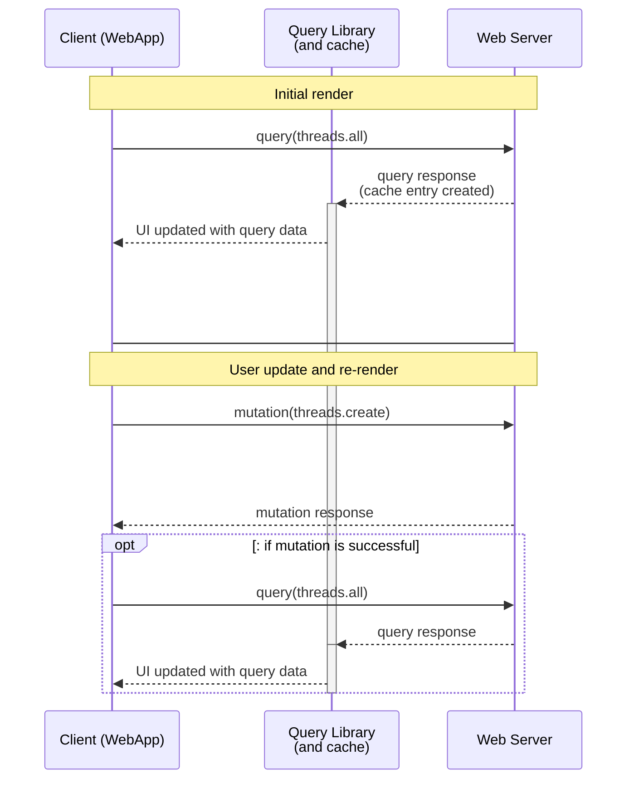
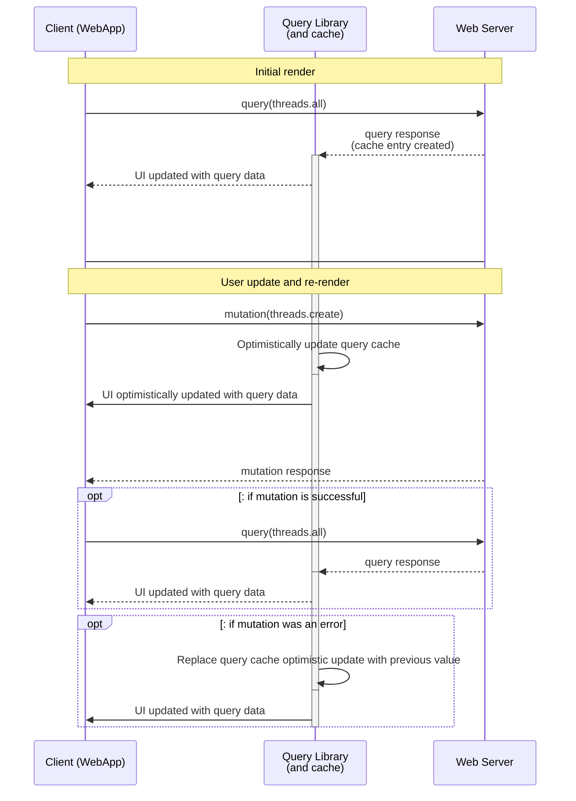
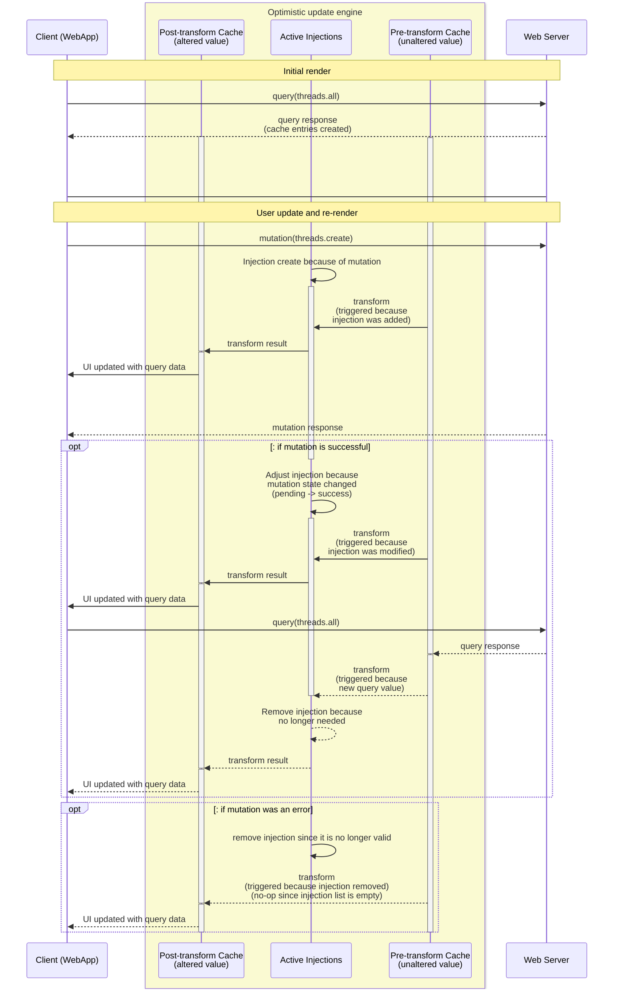

- [Optimistic Updates Engine (a proof-of-concept framework)](#optimistic-updates-engine-a-proof-of-concept-framework)
  - [Disclaimer](#disclaimer)
- [The problem statement - A brief primer on optimistic updates](#the-problem-statement---a-brief-primer-on-optimistic-updates)
- [What Optimistic Update Engine (this library) does](#what-optimistic-update-engine-this-library-does)
  - [Opinion 1 - Optimistic update logic is more closely coupled with the backend than the frontend](#opinion-1---optimistic-update-logic-is-more-closely-coupled-with-the-backend-than-the-frontend)
  - [Opinion 2 - Optimistic updates should be described in terms of immutable transformations](#opinion-2---optimistic-updates-should-be-described-in-terms-of-immutable-transformations)
  - [Opinion 3 - Optimistic updates should be specified as a layer and not ad-hoc](#opinion-3---optimistic-updates-should-be-specified-as-a-layer-and-not-ad-hoc)
- [How does it work?](#how-does-it-work)
  - [Code example](#code-example)
- [How does it actually work (under the hood)??](#how-does-it-actually-work-under-the-hood)
  - [Query Library Integration](#query-library-integration)
  - [Cache Implementation Details](#cache-implementation-details)

# Optimistic Updates Engine (a proof-of-concept framework)

### Disclaimer

So, first up: This idea is not yet fully baked and has many problems in the implementation (among other things, errors in the network stack are not properly propogated through and kind of just swallowed). So don't use it in any real system. You've been warned.

That said I _believe_ most of the problems here are due to "I haven't done that yet", not due to any sort of structural impossibility. It's still under active development and I'm soliciting feedback. Please let me know if you have any interest or comments or anything!

You can see a basic example of it it actually working. [](https://stackblitz.com/github/JonLoesch/optimistic-updates?file=examples%2Ftrpc%2Fsrc%2Foptimistic-updates.ts&startScript=example:stackblitz:trpc) (or see the example code in github [here](examples/trpc/src/optimistic-updates.ts))

# The problem statement - A brief primer on optimistic updates

Optimistic updates are the idea of having the UI update before it recieves final confirmation from the server. Lets use an example of a `threads.all` endpoint for displaying threads, and a `threads.create` endpoint for adding a new one. This is what it may look like for the UI to update after a thread is added:

<details>
<summary>What is a "Query Library"? </summary>
There are lots of ways that web clients can interact with servers, but broadly they fall into two categories: queries for fetching the current state of the world, and mutations for altering the current state of the world. A "Query Library" is generally used to manage the state of these queries, deduplicate them, handle caching, etc... "react-query" is a very popular query library and it is currently the one we're working with. But we're also trying to build things generically so that this is applicable to any query library (SWR, RTK-Query, etc..) So we'll use the generic term "Query Library".
</details>



But what if you want to give the user more immediate feedback? There is theoretically no way for the client to know _exactly_ how the server will respond to a given update, but we can code the client to "optimistically" hope the server will respond with a success and then change its value if it later turns out it was wrong. Optimistic updates can achieve higher _apparent_ response times in web apps at the cost of increased development complexity:



# What Optimistic Update Engine (this library) does

This library is an attempt to help application developers effectively deal with some (not all but some) of the extra development complexity of optimistic updates. In particular, this library attempts to handle the state management of dealing with network requests, and handling the caching of old values and rollbacks on failure. **What's left to the application is the actual logic of how to update the client state assuming a server success**, which is still a big lift and coupled to the actual application so can't really be abstracted into a library.

There are a few opinions and design philosophies in this library. You may disagree with them, but we'll state the rationale up front so you can decide if this library is right for you.

<!-- TODO link to alts -->

<details>
<summary>Note about example and TRPC</summary>
I'm using [TRPC](https://trpc.io/) for my examples below because I think it makes the examples cleaner. TRPC is not necessary for the core of this library, it's just provided as an integration. If you're not familiar with TRPC, what's relevant here is that it provides a way to uniquily identify API endpoints, in a way that also automatically infers their input and return types.
</details>

### Opinion 1 - Optimistic update logic is more closely coupled with the backend than the frontend

This may be counterintuitive, expecially because the optimistic update logic runs in the browser. And it interfaces with the client cache. But those are concerns of the optimistic update _engine_ (i.e. this library), not the optimistic update _application logic_ (i.e. your code). Maybe an example will clarify this. Consider the example code below. Pretend the `engine` variable represents some instance of this library. It selects a set of mutations to operate on (`trpc.threads.delete`). And it selects a query to optimistically alter the value of (`trpc.threads.all`). And then it provides the function to optimistically update the value (`(value, mutationState) => {...}`). In this example, `engine` lives in client space, and the endpoints `trpc.threads.delete` and `trpc.threads.all` live in client space -- but the actual update logic in the callback is dependent on exactly the shape of the API. In this example, the mutation is a simple delete and the query simply returns a list, so the update logic is just an array filter. But in theory, the more complicated your API interface gets, the more complicated the dependencies are between various endpoints, the logic inside `(value, mutationState) => {...}` can get more complex. This library is designed such that none of the code in the transform callback has to deal with frontend concerns at all.

```
  engine.inject(
    trpc.threads.delete, // endpoint for what mutation(s) to optimistically update off of
    trpc.threads.all,    // endpoint for what query(s) to optimistically insert into
    (value, mutationState) => {
      // transform callback.  An injection is created for every
      // (query,mutation) pair that matches the above endpoints.

      // Injection continues until it is stopped, either automatically
      // (via mutation failure) or manually (via returning stopInjection below)

      // the logic here can be as simple or complex as the application needs.
      // In this example we are simply deleting an item from a list unless it's
      // already deleted, in which case we stop injecting
      if (!value.find((x) => x.id === mutationState.input.id)) {
        return stopInjection;
      }
      return value.filter((x) => x.id !== mutationState.input.id);
    }
  );
```

We have designed the library this way so that the transform callbacks can be maintained in a place of code co-located or semi-co-located with where the APIs are actually defined. This is so that changes made to the server API can be tied to the corresponding changes that need to be made to the optimistic update layer.

### Opinion 2 - Optimistic updates should be described in terms of immutable transformations

The above example code has a function that takes a (readonly) `value` and a current `mutationState` and returns a new value (or a `stopInjection` token). This is following a principle of immutable updates. Rather than interacting directly with the client side data store, this library keeps track of all active injections as immutable transformation functions. This has some benefits:

- When injection starts, we can safely maintain two separate cached values -- one directly from the server, and one after injected transformation(s) have been applied. Since transformations are immutable, there's no chance of a transformation messing up the raw from server cache.
- We seamlessly and without any extra effort handle multiple mutations that are active at once affecting a single query.
- When a mutation fails, we don't have to do anything special to roll back the client state. We just remove the transform function from the list and trigger a client refresh.
- If a mutation fires while a related query is already in flight, there's no timing issues or any special logic required. Since all the queries include a pass through the transform function(s) at the very end, and since this pass is not async, (and since javascript is single threaded) there is no chance of a returning query accidentally cloberring over an optimistic update in the client cache

### Opinion 3 - Optimistic updates should be specified as a layer and not ad-hoc

I think optimistic update logic should described as a cross-cutting concern at the application level in some initialization block, not on a per-query or per-mutation level. One of the most common approaches for optimistic updates I am aware of is described [here](https://tanstack.com/query/latest/docs/framework/react/guides/optimistic-updates#updating-a-list-of-todos-when-adding-a-new-todo) and it essentially amounts to putting some extra logic in line with your mutation call, directly in the code where your UI requires it. It's convinient and works for one-offs, but it is my opinion that if your applications gets to the point where it's doing more than a small amount of optimistic update logic this approach will fall down rather quickly.

<details>
<summary>Note</summary>
This isn't to say that Tanstack query doesn't support providing this logic in an initialization block. It does, but this particular linked example doesn't capture that.
</details>

This is clearer to explain with psuedocode I think:

```
// Somewhere in your client initialization:

trpc = ...; // initialize trpc
engine = ...; // initialize optimistic engine

engine.attachToTRPC(trpc);
  // hook into the TRPC process to intercept any
  // queries or mutations and apply logic accordingly

addOptimisticInjections(engine);

<TRPCProvider value={trpc}>
  // this is the part that provides the trpc in a context
  // to the rest of your application (this is unchanged from normal TRPC setup)
  ...
</TRPCProvider>

------------------------------------------------------------------------

// Probably in another file somewhere or split between
// multiple files depending on how complicated it gets:

addOptimisticInjections(engine) {
  engine.inject(...); // This inject call will set up logic for injecting
                      // from a single mutation endpoint into a single query endpoint
  engine.inject(...); // this will be for a different (mutation, query) endpoint pair
  engine.inject(...); // Can be called as many times as needed ...
  ...
}

------------------------------------------------------------------------

// Throughout the rest of the application, useQuery and useMutation
// can be used as normal, and the optimistic update logic will
// happen automatically if the endpoints match the defined injections.

// Probably there will be some way to specify opt-in or opt-out logic
// or something along those lines, but the main point is that the logic
// directoly in the UI should not be more complicated than maybe
// specifying an extra boolean flag
```

# How does it work?

This is the core statement of the optimistic update engine: **Whenever a mutation event happens and an associated query is run, the optimistic engine will use the transform function(s) to transparently alter the return value of the query**. In this statement, "associated" means they have been tied together with an `engine.inject` call. "mutation event" means either a send, a success respone, or an error response. It doesn't matter how many mutations affect a single query, or how many queries are affected by a single mutation. It doesn't matter what in what order the mutations and queries happen. Queries that are in flight at the time of the mutation, queries that are completed and cached at the time of the mutation, queries that don't happen until after the mutation has already started -- all of it works and updates the client UI synchronously.

### Code example

In this psuedocode: after calling `inject` once on application initialization, all active mutations against the `trpc.threads.create` endpoint will affect all queries on the `trpc.threads.all` endpoint, regardless of what order they happen in. For a more real code example and not psuedocode, see [this example](examples/trpc/src/optimistic-updates.ts)

[](https://stackblitz.com/github/JonLoesch/optimistic-updates?file=examples%2Ftrpc%2Fsrc%2Foptimistic-updates.ts&startScript=example:stackblitz:trpc)

```
engine.inject(
  trpc.threads.create,
  trpc.threads.all,
  (value, mutationState) => {
    [...value, (some value based off of mutationState)]
  }
);
```

# How does it actually work (under the hood)??

DISCLAIMER: It should be noted that this library is still at version `0.0.0` in prerelease under active development. It does actually work, I've got some examples ([](https://stackblitz.com/github/JonLoesch/optimistic-updates?file=examples%2Ftrpc%2Fsrc%2FApp.tsx&startScript=example:trpc)) to prove it, and some Jest test cases as well. But the polish isn't quite there yet, and some of the code examples written in this doc are not-quite-right. (In many cases though the code in the doc is how I _want_ things to work it's just not quite there yet).

The core of the library is immutable transofmation functions ([opinion #2](#opinion-2---optimistic-updates-should-be-described-in-terms-of-immutable-transformations)) and two caches, one for the unaltered value and one for the altered value. This is what a basic optimistic workflow looks like under architecture

<details>
<summary>There aren't actually two full caches</summary>
Conceptually, you can think of the list of injections and pre-transform cache as always being there, even through they are pruned when they are not necessary. Most of the rest of this doc considers the pre-transform cache entry as always being present because it cuts down on cases to not have to think about the implementation details of "what if this was the first injection for this query", or "what if this injection was the last to stop for this query" or "what if the query library cache expired this entry while we had active injections", or whatnot.  See [cache issues](#cache-implementation-details) below
</details>



### Query Library Integration

The engine must be attached to a client query library in some way. Depending on which query library is used (react-query, SWR, TRPC, etc...) the specifics might be different, but essentially we need these things from the client fetching library:

- be notified of mutations as they happen (on send, on response, and on error)
- Read / Write access to the query library's cache
  - We also need to be notified when things expire from this cache
- The ability to trigger a full refetch of queries when required (this is perhaps not _strictly_ required but it cuts down a lot on boilerplate)
- The ability to insert ourselves into the _END_ of every query fetch process, as a _synchronous_ process.
- Other minor things:
  - Have some method for filtering mutations and queries by endpoint (for example, TRPC has `path` and react-query has `queryKey`, `mutationKey`)
  - Have some method for converting queries and mutations to something usable as a map key (usually there's some hash or id property)

### Cache Implementation Details

It's mentioned that we have two client caches, pre-transform and one post-transform. That's logically true but there are some implmenetation details. Basically, the query library already has its own cache, and most of the time there are for a given query exactly 0 active injections, meaning that if there were two caches the values would be identical. So, we use the query library's cache to effectively represent the post-transform (that's what the UI is driven off of anyway so it's convinient). The pre-transform cache is handled by the engine and will only exist if there is at least one active injection.

To be extra explicit about state and cache management, at any point in time for any given query the following will be true. (This means the memory footprint of the optimistic update engine should be small; and stable over time):

- There may or may not be a data entry in the query library post-transform cache (i.e. it may have expired)
  - IF AND ONLY IF there is a data entry in the query library post-transform cache:
    - There will be a list of matching injections and associated transform functions in the optimistic engine
      - IF AND ONLY IF the list of matching injections has at least 1 element:
        - There will be a data pre-transform cache entry in the optimistic update engine

<!-- # Alternatives

TODO edit/rewrite
There are a couple possible solutions to #1 that are not nearly as invasive or complex as what I've done here, so lets talk about those alternatives:

- Write a custom hook (e.g. `useUpdateTodo`) that encapsulates everything about the mutation: the parameters of the mutation, the endpoint to call, the mutation key (if any), cache/retry parameters (if any). This can of course include event handlers like `onMutate`, `onError`, `onSuccess`, and `onSettled`, which means you can implement the above logic in a central place.
  - It does mean writing a separate hook function for each endpoint you want to encapsulate which is kind of a bit messy in terms of namespace pollution to me, but I suppose that's a minor issue
  - It does also mean that your encapsulations have to be aware of the concept of react hooks (or whatever flavor UI abstraction).
    - Why does the logic that has to do with tweaking cache data from the API have any knowledge of your frontend architecture? If I have local state or effects associated with that `useUpdateTodo`, that means I'm even closer tying it to react
    - Why should I worry about whether my `useUpdateTodo` is reference stable on rerenders? Why should I even be worrying about rerenders at all inside of `useUpdateTodo`?
- If you're using another tool to build your mutation option objects (as I am with TRPC), then you might be able to hook into that third party tool to specify the handlers for you (`onMutate`, `onError` etc...)
  - This is obviously dependent on what layer or tool you are using on top of TanStack Query. But it's also needing to interface directly with the TanStack Query Cache. So you're interacting somwhat deeply with two related-but-not-the-same levels of your application stack. Which is ... not that big a deal from a practical point of view, but seems distasteful to me.
- Use [QueryClient.setMutationDefaults](https://tanstack.com/query/latest/docs/reference/QueryClient/#queryclientsetmutationdefaults) -- This allows you to specify once at an application-wide level, what optimistic update logic will apply to which mutation keys.

  - It means you need to use mutation keys, but IMO this is no big deal. (I may be biased because I'm using TanStack Query through TRPC, so I've always got autogenerated keys anyway)
  - For reference, here is how you would implement the above:

    ```
    // Run once near the root of your application:
    const queryClient = useQueryClient()
    queryClient.setMutationDefaults(['addTodo'], {
      mutationFn: updateTodo,
      // When mutate is called:
      onMutate: async (newTodo) => {
        // ... exactly the same as the above code ...
      },
      onError: // ... also the same
      onSettled: // ... also the same
    });

    // to mutate
    useMutation({
      mutationKey: ['addTodo'],
    })
    ```

  - The fact that the interface is basically identical to the `useMutation` options is also of incredible practical value, in terms of being able to really quickly port code from global options for everywhere in your application this is used, to an ad-hoc basis, or vice versa. -->
