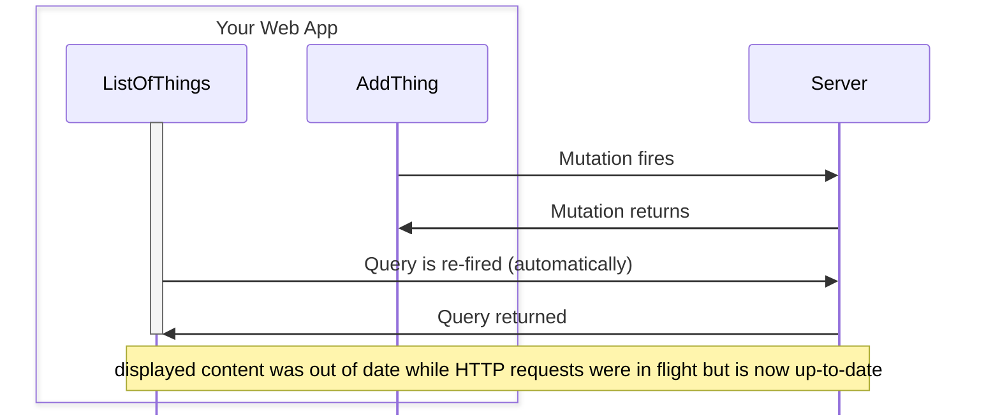
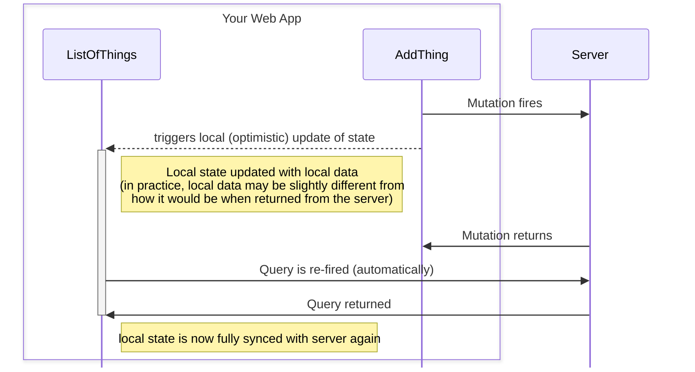

# Features

This is a library (currently in an early proof-of-concept stage) that attempts to make it easier to implement optimistic engine functionality in your web app. There are three core features we're focusing on:

1. **Transformations are Functions on Immutable data** -- This makes it so we can abstract away updating the cache, so that you (as the client of this library) never have to deal with updating the cache yourself. We believe that providing immutable transform functions is an easier and more flexible way of defining how a query state is affected by ongoing state changes.
2. **Transformations are declared separately from UI code** -- This means that your UI doesn't have to concern itself with exactly how the data updates happen, you just use whatever query fetching pattern you're already using and the extra functionality is patched in under the hood.
3. **Query fetching pattern agnostic** -- There are integrations written for [TRPC](https://trpc.io/) and [React Query](https://tanstack.com/query/latest/docs/framework/react/overview) currently, because that's what started me writing this library. However, almost all of the code is generic enough to be applied to any query framework. (SWR, RTK-Query, Vue or Svelte versions of Tanstack Query...) I imagine that if and when this library becomes more mature those will be filled in over time. If you want support for a particular framework, [contact me](#feedback)

# Overview / basic peudocode example

Let's say you have a component that renders a list of items, pulled from the server:

<Codesplit>
<Codesplit.TRPC>
```ts
function ListOfThings() {
  const things = useQuery(trpc.some.query.endpoint.queryOptions());
  return (
    <div>
      {things.isSuccess &&
        things.data.map((item) => {
          // ...
        })
      }
    </div>
  );
}
```
</Codesplit.TRPC>
</Codesplit>

And then you also have elsewhere (in the same page) a component that uses an API endpoint to add an item to the list:

<Codesplit>
<Codesplit.TRPC>
```ts
function AddThing() {
  const addItem = useMutation(trpc.some.mutation.endpoint.mutationOptions());

return (
<input
type="button"
value="Add New Item"
onClick={() => {
addItem.mutate(/_ ... _/);
}}
/>
);
}

````
</Codesplit.TRPC>
</Codesplit>
```mermaid
 %%{init: {  'sequence': {'mirrorActors':false} } }%%
 sequenceDiagram
    box Your Web App
        participant L as ListOfThings
        participant A as AddThing
    end
    participant S as Server
    A->>S: Mutation fires
    S->>A: Mutation returns
    Note over L,S: <- Now displayed content is out of date and won't be updated without a page reload
````

With optimistic update engine, you can get the first component to automatically refetch whenever the second completes a mutation. And you can do this without needing to modify the actual components' view logic. By adding the following code to your application setup, you can cause any code that fires a particular mutation to automatically trigger a refetch for related queries:

<Codesplit>
<Codesplit.TRPC>
```ts
  engine.inject({
    from: trpc.some.mutation.endpoint,
    into: trpc.some.query.endpoint,
  });
```
</Codesplit.TRPC>
</Codesplit>


That's honestly not that useful by itself, there's lots of (arguably simpler) ways of doing that. The real point of this library is to provide optimistic data transformations, so that the local state of the affected query will be updated as soon as the mutation fires, without needing to wait for it to return:

```ts
  engine.inject({
    from: /* same as above */,
    into: /* same as above */,
    transform(
      listFromQuery, /*Immutable object representing the result of the query*/
      mutationState, /* Immutable object representing the current state (input, maybe output, maybe error) of the mutation */
    ) {
      return [...listFromQuery, {/* object constructed locally from mutationState */}];
    },
  });
```



> [!NOTE]
>
> In the previous diagram, the gray window of time (on the `ListOfThings` column) was the time that the local state was completely out of date. In this diagram, the same gray box represents the duration of time where local state is an "optimistic" state. That is, the length of time where the UI is rendering what it **hopes** the server will return. Optimistic Update logic can reduce apparent response times, but at the cost of adding development complexity. The goal of this library is to reduce that added complexity, but it will not eliminate entirely.

There's a bit more to it -- there's some boilerplate setup I'm skipping over, and the `transform` function is a bit more complicated than I'm making it seem (it has to recognize when the server recieves the value and return a `stopInjection` token). But that's the gist of it. If this is something that sounds intriguing to you, there are more throrough docs for you to dive into. Be aware that it is still an early stage concept. There are still a few problems in the implementation (among other things, errors in the network stack are not properly propogated through and kind of just swallowed). So don't use it in any real system. You've been warned.

### Feedback

If you are interested in this idea or have any feedback at all (positive or negative), I'd love to hear it! Probably the best way right now is to post on [the github discussions page](https://github.com/JonLoesch/optimistic-updates/discussions)
